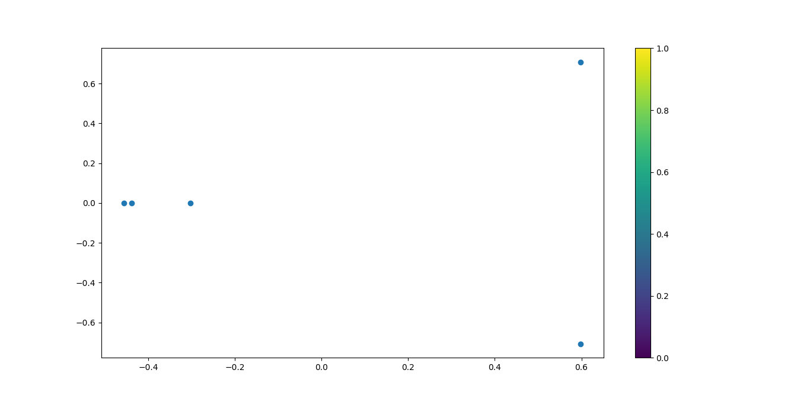

# Directory Structure
```text
.
├── api_test.py
├── app.py
├── data
│   └── newsgroups.txt
├── docker-compose.yml
├── Dockerfile
├── embedding
│   ├── tf-idf-283fe.pkl
│   ├── tf-idf-3sf18.pkl
│   ├── tf-idf-4408d.pkl
│   ├── tf-idf-o8am4.pkl
│   └── tf-idf-tikya.pkl
├── figures
│   ├── Figure_pca-data.png
│   ├── Figure_pca-preds.png
│   ├── Figure_tsne-data.png
│   └── Figure_tsne-preds.png
├── labeled-data
│   ├── newsgroups-labeled.csv
│   ├── newsgroups-labeled.json
│   └── newsgroups-labeled.txt
├── README.md
├── requirements.txt
├── run.py
├── utils
│   ├── data.py
│   ├── __init__.py
│   ├── model.py
│   └── plot.py
└── weights
    ├── K-means-4xhov.pkl
    ├── K-means-9fn0t.pkl
    ├── K-means-bgp2j.pkl
    ├── K-means-mwfm6.pkl
    └── K-means-t618j.pkl

6 directories, 29 files

```
# Command Line Interface
```text
usage: run.py [-h] [--fname {newsgroups}] [--clusters CLUSTERS]

optional arguments:
  -h, --help            show this help message and exit
  --fname {newsgroups}  Data Source filenames
  --clusters CLUSTERS   How many Label we want

```

# Data
```text
Features: newsgroups sentences
```
```text
Labels: It gives you Labels!
```
## Plot newsgroups Sentences to TD-IDF Embeddings with 2D PCA & 3D TSNE

### Unlabeled newsgroups Sentences TF-IDF Embeddings to 2D PCA



### Unlabeled newsgroups Sentences TF-IDF Embeddings to 3D TSNE


# Build & Train & Test the KMeans model

## Train the KMeans model

### Parameteres

```text
fname: Data Source file name
```
```text
clusters: How many Label we want 
```

```shell
 python run.py --fname newsgroups --clusters 2

```

# Test the KMeans model

## Data Source - newsgroups data
```text
Quantum physics is quite important in science nowadays
```
```text
Software engineering is hotter and hotter topic in the silicon valley
```
```text
Investing in stocks and trading with them are not that easy
```
```text
FOREX is the stock market for trading currencies
```
```text
Warren Buffet is famous for making good investments. He knows stock markets
```

## Labeled newsgroups data

|           | 0                                                           | 1                                                                     | 2                                                                           |
|:----------|:------------------------------------------------------------|:----------------------------------------------------------------------|:----------------------------------------------------------------------------|
| cluster_0 | Quantum physics is quite important in science nowadays      | Software engineering is hotter and hotter topic in the silicon valley |                                                                             |
| cluster_1 | Investing in stocks and trading with them are not that easy | FOREX is the stock market for trading currencies                      | Warren Buffet is famous for making good investments. He knows stock markets |

### Labeled newsgroups Sentences TF-IDF Embeddings to 2D PCA


### Labeled newsgroups Sentences TF-IDF Embeddings to 3D TSNE


# Docker for the KMeans model

## Build the Docker image

You can build docker image by following:

```shell
docker-compose build
```

## Run Docker container

You can launch a container from the Docker image by following:

```shell
docker-compose up
```

